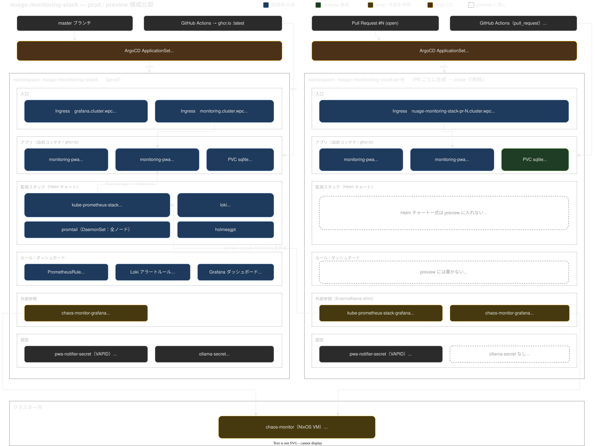

# preview 環境

open な PR 1本につき 1環境を `nuage-monitoring-stack-pr-<N>` namespace に自動で立ち上げる。
PR を立てれば生え、close/merge すれば namespace ごと消える。

対象は monitoring-pwa（frontend / backend）だけで、監視スタック本体は prod のものを見る。

- URL: `https://nuage-monitoring-stack-pr-<N>.cluster.wpc`

